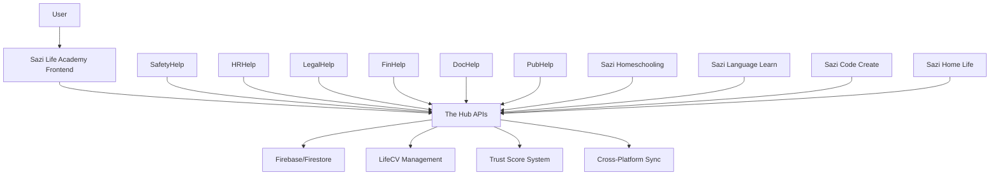

# Sazi Life Academy Integration Specifications
**Document ID**: SAZI-INTEGRATION-SPECS-V3.0  
**Status**: Technical Implementation Guide  
**Date**: September 4, 2025  
**Scope**: Complete Ecosystem Integration Framework

## Executive Summary

This document provides the comprehensive technical specifications for integrating Sazi Life Academy with The Hub backend and all Salatiso Ecosystem modules. The specifications ensure seamless data flow, unified user experience, and cohesive platform functionality while maintaining each module's specialized capabilities.

## Integration Architecture Overview

### Hub-Centric Backend Architecture
**All Platforms → The Hub → Synchronized Data**

```javascript
const ecosystemArchitecture = {
  backend: {
    primary: 'The Hub (Firebase/Firestore)',
    authentication: 'Unified SSO System',
    dataStorage: 'Centralized with module-specific extensions',
    apiGateway: 'Hub-mediated cross-platform communication'
  },
  
  frontend: {
    saziLifeAcademy: 'Educational interface and training catalog',
    specializedModules: 'Domain-specific functionality',
    userInterface: 'Consistent design system across platforms',
    navigation: 'Seamless cross-platform transitions'
  }
}
```

### Data Flow Architecture



## The Hub Integration Specifications

### Authentication & User Management

#### Unified Identity System
**Single Sign-On Implementation:**

```javascript
const unifiedAuth = {
  provider: 'Firebase Authentication',
  tokenManagement: {
    jwtTokens: 'cross_platform_validity',
    refreshStrategy: 'automatic_renewal',
    sessionSync: 'real_time_across_platforms'
  },
  
  userProfile: {
    masterProfile: 'stored_in_hub',
    moduleExtensions: 'platform_specific_data',
    synchronization: 'real_time_updates',
    privacyControls: 'granular_permissions'
  }
}
```

**Implementation Pattern:**
```jsx
// Unified Authentication Hook
const useUnifiedAuth = () => {
  const [user, setUser] = useState(null)
  const [hubProfile, setHubProfile] = useState(null)
  
  useEffect(() => {
    const unsubscribe = onAuthStateChanged(auth, async (firebaseUser) => {
      if (firebaseUser) {
        const hubUserProfile = await fetchHubProfile(firebaseUser.uid)
        setUser(firebaseUser)
        setHubProfile(hubUserProfile)
        syncCrossPlatform(firebaseUser.uid)
      }
    })
    
    return unsubscribe
  }, [])
  
  return { user, hubProfile, isAuthenticated: !!user }
}
```

### Data Storage & Synchronization

#### Hub-Centric Data Management
**Centralized Storage with Module Extensions:**

```javascript
const dataStructure = {
  users: {
    core: {
      // The Hub primary data
      userId: 'string',
      profile: 'object',
      preferences: 'object',
      trustScore: 'number'
    },
    
    modules: {
      saziLifeAcademy: {
        learningPaths: 'array',
        courseProgress: 'object',
        certificates: 'array',
        teachingActivity: 'object'
      },
      
      lifecv: {
        evidence: 'array',
        skills: 'object',
        achievements: 'array',
        portfolio: 'object'
      },
      
      professional: {
        safetyHelp: 'object',
        hrHelp: 'object',
        legalHelp: 'object',
        finHelp: 'object'
      }
    }
  }
}
```

#### Real-Time Synchronization System
**Cross-Platform Data Consistency:**

```javascript
const syncManager = {
  realTimeSync: ['chat', 'progress', 'collaboration'],
  periodicSync: ['portfolio', 'achievements', 'course_completion'],
  onDemandSync: ['resource_downloads', 'assessment_submission'],
  
  syncStrategy: {
    conflictResolution: 'timestamp_based_merge',
    offlineSupport: 'local_storage_with_sync',
    dataValidation: 'schema_enforcement',
    errorHandling: 'retry_with_backoff'
  }
}
```

### API Gateway Architecture

#### Hub-Mediated Cross-Platform Communication
**Centralized API Management:**

```javascript
const apiGateway = {
  baseUrl: 'https://the-hub.salatiso.com/api',
  
  endpoints: {
    auth: {
      login: '/auth/login',
      refresh: '/auth/refresh',
      profile: '/auth/profile'
    },
    
    learning: {
      courses: '/learning/courses',
      progress: '/learning/progress',
      assessments: '/learning/assessments',
      certificates: '/learning/certificates'
    },
    
    lifecv: {
      portfolio: '/lifecv/portfolio',
      evidence: '/lifecv/evidence',
      skills: '/lifecv/skills',
      verification: '/lifecv/verification'
    },
    
    community: {
      groups: '/community/groups',
      discussions: '/community/discussions',
      mentorship: '/community/mentorship'
    },
    
    crossPlatform: {
      moduleData: '/cross-platform/module-data',
      userSync: '/cross-platform/user-sync',
      notifications: '/cross-platform/notifications'
    }
  }
}
```

## Sazi Life Academy Frontend Specifications

### Enhanced Dashboard Implementation

#### Comprehensive Learning Dashboard
**Primary Interface Component:**

```jsx
const SaziLifeAcademyDashboard = () => {
  const { user, hubProfile } = useUnifiedAuth()
  const { learningData } = useLearningData(user?.uid)
  const { ecosystemData } = useEcosystemData(user?.uid)
  
  return (
    <div className="dashboard-container">
      <WelcomeHeader user={hubProfile} />
      
      <div className="dashboard-grid">
        <CurrentLearningSection data={learningData.current} />
        <ProgressOverview data={learningData.progress} />
        <EcosystemIntegration data={ecosystemData} />
        <CommunityActivity data={learningData.community} />
        <RecommendedCourses data={learningData.recommendations} />
        <LifeCVPortfolio data={hubProfile.lifecv} />
      </div>
      
      <QuickActions />
    </div>
  )
}
```

#### Training Catalog Integration
**Complete Ecosystem Course Catalog:**

```jsx
const TrainingCatalog = () => {
  const [courses, setCourses] = useState([])
  const [filters, setFilters] = useState({
    category: 'all',
    level: 'all',
    module: 'all',
    language: 'en'
  })
  
  useEffect(() => {
    const fetchCourses = async () => {
      const ecosystemCourses = await Promise.all([
        fetchSaziCourses(),
        fetchProfessionalCourses(), // From all professional modules
        fetchSpecializedCourses()   // From specialized modules
      ])
      
      setCourses(ecosystemCourses.flat())
    }
    
    fetchCourses()
  }, [filters])
  
  return (
    <div className="training-catalog">
      <FilterSection filters={filters} onFilterChange={setFilters} />
      <CourseGrid courses={filteredCourses} />
      <RecommendationEngine userId={user?.uid} />
    </div>
  )
}
```

### Community Learning Features

#### Class Creation & Management System
**Scalable Learning Community Tools:**

```jsx
const CommunityLearningHub = () => {
  const [userClasses, setUserClasses] = useState([])
  const [communityGroups, setCommunityGroups] = useState([])
  
  return (
    <div className="community-hub">
      <ClassManagement classes={userClasses} />
      <CreateClassWizard />
      <LocalGroups groups={communityGroups} />
      <KnowledgeSharingBoard />
      <MentorshipConnections />
    </div>
  )
}

const CreateClassWizard = () => {
  const [classType, setClassType] = useState('family')
  const [classConfig, setClassConfig] = useState({})
  
  const classTypes = {
    family: { maxLearners: 5, features: ['basic'] },
    extended: { maxLearners: 15, features: ['enhanced'] },
    community: { maxLearners: 50, features: ['comprehensive'] },
    public: { maxLearners: 'unlimited', features: ['broadcast'] }
  }
  
  return (
    <div className="class-wizard">
      <ClassTypeSelector 
        types={classTypes} 
        selected={classType}
        onChange={setClassType}
      />
      <ClassConfiguration 
        type={classType}
        config={classConfig}
        onChange={setClassConfig}
      />
      <FeatureSelection features={classTypes[classType].features} />
      <CreateClassButton config={classConfig} />
    </div>
  )
}
```

### Communication System Integration

#### Multi-Modal Communication Framework
**Optimized for Rural & Resource-Constrained Environments:**

```jsx
const CommunicationSystem = ({ classId, participants }) => {
  const [communicationMode, setCommunicationMode] = useState('text')
  const [bandwidthMode, setBandwidthMode] = useState('auto')
  
  return (
    <div className="communication-system">
      <ConnectionStatus bandwidth={bandwidthMode} />
      <ModeSelector 
        modes={['text', 'audio', 'video']}
        current={communicationMode}
        onChange={setCommunicationMode}
      />
      
      {communicationMode === 'text' && (
        <TextChatSystem 
          classId={classId}
          participants={participants}
          features={['translation', 'offline_queue', 'file_sharing']}
        />
      )}
      
      {communicationMode === 'audio' && (
        <AudioSystem 
          classId={classId}
          features={['voice_messages', 'low_bandwidth_optimized']}
        />
      )}
      
      {communicationMode === 'video' && (
        <VideoSystem 
          classId={classId}
          adaptiveBandwidth={true}
          fallbackOptions={['audio_only', 'text_chat']}
        />
      )}
    </div>
  )
}
```

## Professional Module Integration

### Training Partnership Framework
**"Powered by Sazi Life Academy" Implementation:**

```javascript
const professionalModuleIntegration = {
  branding: {
    format: '[Module Name] Professional Development in partnership with Sazi Life Academy',
    examples: {
      safetyHelp: 'SafetyHelp Professional Development in partnership with Sazi Life Academy',
      hrHelp: 'HRHelp Professional Development in partnership with Sazi Life Academy',
      legalHelp: 'LegalHelp Education in partnership with Sazi Life Academy'
    }
  },
  
  technicalIntegration: {
    courseDelivery: 'through_sazi_life_academy_platform',
    progressTracking: 'unified_across_ecosystem',
    certification: 'module_specific_with_sazi_validation',
    portfolioIntegration: 'automatic_lifecv_updates'
  }
}
```

### Course Content Synchronization
**Module-Specific Training Integration:**

```jsx
const ProfessionalTrainingIntegration = () => {
  const modules = [
    'SafetyHelp', 'HRHelp', 'LegalHelp', 'FinHelp', 
    'DocHelp', 'PubHelp', 'BizHelp'
  ]
  
  return (
    <div className="professional-training">
      {modules.map(module => (
        <ModuleTrainingSection 
          key={module}
          moduleName={module}
          courses={getModuleCourses(module)}
          branding={`${module} Professional Development in partnership with Sazi Life Academy`}
        />
      ))}
    </div>
  )
}

const ModuleTrainingSection = ({ moduleName, courses, branding }) => {
  return (
    <div className="module-section">
      <h2>{branding}</h2>
      <CourseList courses={courses} />
      <ProgressTracking module={moduleName} />
      <CertificationPath module={moduleName} />
      <PortfolioIntegration module={moduleName} />
    </div>
  )
}
```

## LifeCV Integration Specifications

### Evidence Collection Framework
**Comprehensive Portfolio Building:**

```javascript
const lifecvIntegration = {
  evidenceTypes: {
    courseCompletion: {
      source: 'sazi_life_academy',
      validation: 'automatic',
      metadata: ['completion_date', 'course_details', 'practical_projects']
    },
    
    practicalProjects: {
      source: 'user_submission',
      validation: 'community_review',
      metadata: ['project_description', 'outcomes', 'evidence_files']
    },
    
    skillDemonstration: {
      source: 'assessment_results',
      validation: 'peer_review',
      metadata: ['skill_area', 'proficiency_level', 'verification_method']
    },
    
    communityContribution: {
      source: 'teaching_activity',
      validation: 'participant_feedback',
      metadata: ['contribution_type', 'impact_metrics', 'community_feedback']
    }
  }
}
```

### Portfolio Management System
**Automated Evidence Collection:**

```jsx
const LifeCVIntegration = ({ userId }) => {
  const [portfolio, setPortfolio] = useState(null)
  const [pendingEvidence, setPendingEvidence] = useState([])
  
  useEffect(() => {
    const subscribeToLearningProgress = () => {
      // Automatically capture course completions
      // Track skill developments
      // Monitor community contributions
      // Update portfolio in real-time
    }
    
    subscribeToLearningProgress()
  }, [userId])
  
  return (
    <div className="lifecv-integration">
      <PortfolioOverview portfolio={portfolio} />
      <EvidenceQueue pending={pendingEvidence} />
      <SkillsMatrix skills={portfolio?.skills} />
      <AchievementTimeline achievements={portfolio?.achievements} />
      <ValidationStatus portfolio={portfolio} />
    </div>
  )
}
```

## Trust Score System Integration

### Community Validation Framework
**Trust-Based Credibility Building:**

```javascript
const trustScoreSystem = {
  calculationFactors: {
    portfolioEvidence: {
      weight: 0.3,
      components: ['project_quality', 'evidence_completeness', 'real_world_application']
    },
    
    communityFeedback: {
      weight: 0.25,
      components: ['teaching_effectiveness', 'collaboration_quality', 'helpfulness']
    },
    
    consistentDelivery: {
      weight: 0.2,
      components: ['course_completion_rate', 'commitment_reliability', 'quality_consistency']
    },
    
    reciprocityParticipation: {
      weight: 0.15,
      components: ['knowledge_sharing', 'community_support', 'mentorship_activity']
    },
    
    skillDemonstration: {
      weight: 0.1,
      components: ['practical_application', 'problem_solving', 'innovation']
    }
  }
}
```

### Validation Workflow Implementation
**Community-Driven Skill Verification:**

```jsx
const CommunityValidation = ({ evidenceSubmission }) => {
  const [reviewers, setReviewers] = useState([])
  const [validationStatus, setValidationStatus] = useState('pending')
  
  return (
    <div className="validation-workflow">
      <EvidenceDisplay evidence={evidenceSubmission} />
      <ReviewerAssignment reviewers={reviewers} />
      <ReviewGuidelines criteria={getValidationCriteria(evidenceSubmission.type)} />
      <FeedbackCollection />
      <ValidationDecision status={validationStatus} />
      <TrustScoreUpdate userId={evidenceSubmission.userId} />
    </div>
  )
}
```

## Guest Access System Specifications

### 7-Day Renewable Access Framework
**Comprehensive Guest Management:**

```javascript
const guestAccessSystem = {
  configuration: {
    initialPeriod: 7, // days
    maxRenewals: 5,
    totalGuestDays: 35,
    warningPeriods: [2, 1, 0] // days before expiry
  },
  
  dataManagement: {
    storage: 'local_storage_with_cloud_backup',
    progressTracking: 'temporary_with_export_option',
    migrationOnRegistration: 'automatic_data_transfer',
    purgeAfterExpiry: 'grace_period_then_delete'
  },
  
  featureRestrictions: {
    guestAccess: ['view_content', 'basic_progress_tracking', 'limited_community_participation'],
    registeredAccess: ['full_features', 'permanent_storage', 'complete_community_access', 'lifecv_integration']
  }
}
```

### Guest Progress Management
**Seamless Transition to Full Access:**

```jsx
const GuestAccessManager = () => {
  const [guestStatus, setGuestStatus] = useState(null)
  const [renewalCount, setRenewalCount] = useState(0)
  const [dataExportReady, setDataExportReady] = useState(false)
  
  useEffect(() => {
    const checkGuestStatus = () => {
      const status = getGuestAccessStatus()
      setGuestStatus(status)
      
      if (status.daysRemaining <= 2) {
        prepareDataExport()
      }
    }
    
    checkGuestStatus()
  }, [])
  
  return (
    <div className="guest-access-manager">
      <AccessStatusBanner status={guestStatus} />
      {guestStatus?.daysRemaining <= 2 && (
        <ExpiryWarning 
          daysRemaining={guestStatus.daysRemaining}
          renewalsLeft={5 - renewalCount}
        />
      )}
      <RenewalOptions renewalCount={renewalCount} />
      <RegistrationIncentives />
      {dataExportReady && <DataExportTools />}
    </div>
  )
}
```

## Offline Capability Specifications

### Homestead OS Integration
**Complete Offline Functionality:**

```javascript
const offlineCapability = {
  downloadManagement: {
    coursePackages: 'complete_modules_with_media',
    assessmentTools: 'offline_compatible_versions',
    communicationLogs: 'local_storage_with_sync',
    progressData: 'local_tracking_with_cloud_sync'
  },
  
  syncStrategies: {
    immediate: ['critical_progress', 'assessment_submissions'],
    periodic: ['general_progress', 'content_updates'],
    onConnect: ['cached_communications', 'pending_submissions'],
    background: ['content_prefetch', 'system_updates']
  }
}
```

### Low-Bandwidth Optimization
**Rural Accessibility Focus:**

```jsx
const LowBandwidthOptimization = () => {
  const [connectionMode, setConnectionMode] = useState('auto')
  const [dataUsage, setDataUsage] = useState(0)
  
  return (
    <div className="bandwidth-optimization">
      <ConnectionModeSelector 
        modes={['low_bandwidth', 'standard', 'high_bandwidth', 'auto']}
        current={connectionMode}
        onChange={setConnectionMode}
      />
      
      <DataUsageMonitor usage={dataUsage} />
      
      <ContentOptimization mode={connectionMode}>
        <TextPrimaryInterface />
        <CompressedImageLoader />
        <OptionalVideoContent />
        <AudioCompressionSettings />
      </ContentOptimization>
      
      <OfflineContentManager />
    </div>
  )
}
```

## Quality Assurance & Testing Framework

### Comprehensive Testing Strategy
**Multi-Platform Integration Testing:**

```javascript
const testingFramework = {
  unitTesting: {
    components: 'individual_component_functionality',
    services: 'api_integration_reliability',
    utilities: 'helper_function_accuracy'
  },
  
  integrationTesting: {
    crossPlatform: 'data_sync_across_modules',
    authentication: 'sso_functionality_verification',
    communication: 'real_time_messaging_reliability'
  },
  
  userAcceptanceTesting: {
    communityDriven: 'real_user_feedback_integration',
    accessibilityFocused: 'rural_user_testing',
    performanceBased: 'low_resource_environment_testing'
  }
}
```

## Deployment & DevOps Specifications

### Continuous Integration Pipeline
**Ecosystem-Wide Deployment Coordination:**

```yaml
# .github/workflows/ecosystem-integration.yml
name: Ecosystem Integration Pipeline

on:
  push:
    branches: [main, development]
  pull_request:
    branches: [main]

jobs:
  integration_tests:
    runs-on: ubuntu-latest
    steps:
      - name: Hub Integration Test
        run: npm run test:hub-integration
      
      - name: Cross-Platform Sync Test
        run: npm run test:cross-platform-sync
      
      - name: Data Consistency Test
        run: npm run test:data-consistency

  deployment:
    needs: integration_tests
    runs-on: ubuntu-latest
    steps:
      - name: Deploy to Staging
        run: npm run deploy:staging
      
      - name: Integration Smoke Tests
        run: npm run test:smoke-integration
      
      - name: Deploy to Production
        run: npm run deploy:production
```

## Security & Privacy Specifications

### Data Protection Framework
**Comprehensive Privacy & Security:**

```javascript
const securityFramework = {
  dataEncryption: {
    inTransit: 'TLS_1.3_minimum',
    atRest: 'AES_256_encryption',
    keyManagement: 'firebase_security_rules'
  },
  
  privacyControls: {
    dataMinimization: 'collect_only_necessary_data',
    userConsent: 'granular_permission_system',
    dataPortability: 'export_all_user_data',
    rightToErasure: 'complete_data_deletion'
  },
  
  accessControls: {
    authentication: 'multi_factor_available',
    authorization: 'role_based_access_control',
    sessionManagement: 'secure_token_handling'
  }
}
```

## Performance Optimization Specifications

### Scalability & Performance Framework
**Ecosystem-Wide Performance Management:**

```javascript
const performanceOptimization = {
  frontend: {
    codesplitting: 'module_based_loading',
    lazyLoading: 'component_level_optimization',
    caching: 'intelligent_content_caching',
    bundleOptimization: 'tree_shaking_and_minification'
  },
  
  backend: {
    databaseOptimization: 'firestore_query_optimization',
    apiCaching: 'intelligent_response_caching',
    loadBalancing: 'automatic_scaling',
    monitoringAlerts: 'performance_threshold_monitoring'
  }
}
```

## Conclusion

These integration specifications provide the comprehensive technical framework for transforming Sazi Life Academy into the educational powerhouse of the Salatiso Ecosystem. The implementation ensures:

1. **Seamless User Experience**: Unified navigation and data synchronization across all platforms
2. **Comprehensive Learning**: Integration of all ecosystem training into a cohesive educational framework
3. **Community Empowerment**: Tools for creating and managing learning communities of all sizes
4. **Trust-Based Recognition**: Evidence-based skill validation and community-driven credibility
5. **Universal Accessibility**: Support for all connectivity levels and device capabilities

The result is an educational ecosystem that truly embodies the principle of **"competence over credentials"** while building strong community connections and practical life skills.

**"From a single seed, a forest of knowledge."**
