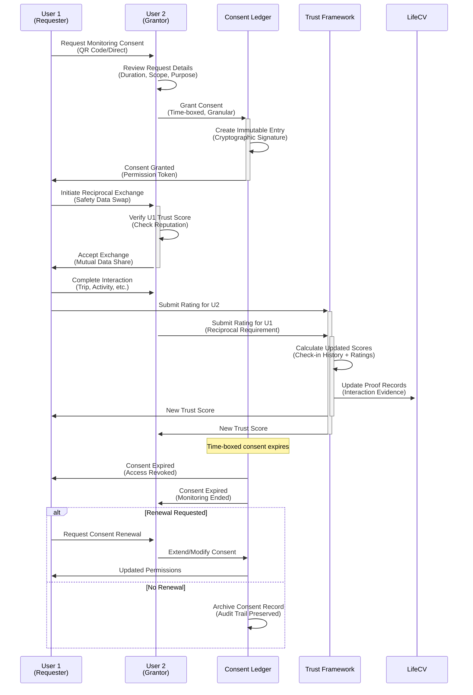
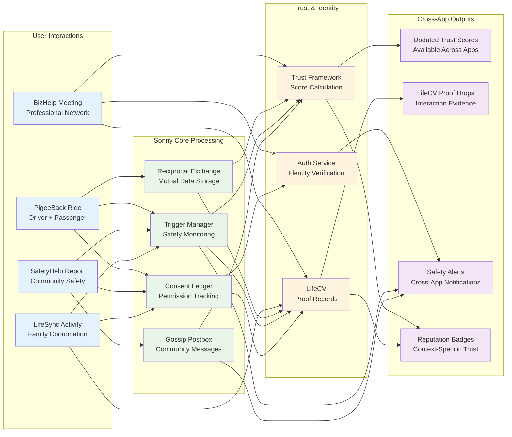
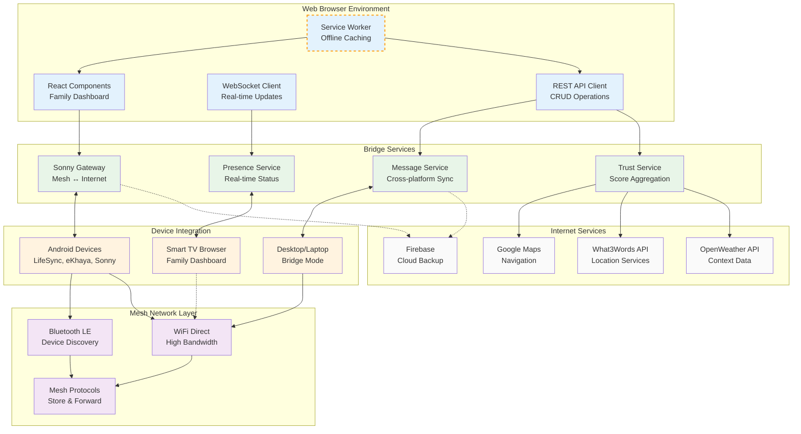

# Sonny Ecosystem Architecture Diagrams
**Version:** 1.0  
**Created:** October 13, 2025  
**Format:** Mermaid Textual Definitions

---

## 1. High-Level Ecosystem Architecture

```mermaid
graph TB
    subgraph "MNI Ecosystem Apps"
        LS[LifeSync<br/>Android Master Hub]
        EK[eKhaya<br/>Mobile Home Mgmt]
        SC[Sonny Chat<br/>Lightweight Mesh]
        WEB[Web Platform<br/>Smart TV Bridge]
    end
    
    subgraph "Specialized Apps"  
        PB[PigeeBack<br/>Transport Safety]
        SH[SafetyHelp<br/>Community Incidents]
        BH[BizHelp<br/>Professional Network]
        HR[HRHelp<br/>Workplace Safety]
    end
    
    subgraph "Sonny Core Services"
        ME[Mesh Engine<br/>BLE + WiFi Direct]
        TM[Trigger Manager<br/>Safety Automation]
        CL[Consent Ledger<br/>Permission Tracking]
        RS[Reciprocal Exchange<br/>Mutual Data Vault]
        GP[Gossip Postbox<br/>Community Messages]
    end
    
    subgraph "Identity & Trust Layer"
        LCV[LifeCV<br/>Proof System]
        TF[Trust Framework<br/>Reputation Engine]
        AU[Auth Service<br/>Identity Management]
    end
    
    subgraph "External Services"
        W3W[What3Words API<br/>Precise Locations]
        WX[OpenWeather API<br/>Context Data]
        GM[Google Maps<br/>Navigation]
        FB[Firebase<br/>Cloud Backup]
    end
    
    %% App connections to Sonny Core
    LS --> ME
    LS --> TM  
    LS --> CL
    LS --> RS
    
    EK -.-> ME
    EK -.-> TM
    
    SC --> ME
    SC --> GP
    
    WEB --> ME
    WEB --> TM
    
    PB --> RS
    PB --> TF
    
    SH --> GP
    SH --> CL
    
    BH --> TF
    HR --> TF
    
    %% Identity integration
    ME --> LCV
    TM --> LCV  
    RS --> TF
    CL --> AU
    
    %% External API connections
    LS --> W3W
    LS --> WX
    WEB --> GM
    
    %% Cloud backup (optional)
    LS -.-> FB
    WEB --> FB
    
    %% Styling
    classDef coreApp fill:#e1f5fe
    classDef specializedApp fill:#f3e5f5  
    classDef sonnyCore fill:#e8f5e8
    classDef identity fill:#fff3e0
    classDef external fill:#fafafa
    
    class LS,EK,SC,WEB coreApp
    class PB,SH,BH,HR specializedApp
    class ME,TM,CL,RS,GP sonnyCore
    class LCV,TF,AU identity
    class W3W,WX,GM,FB external
```



---

## 2. Sonny Mesh Network Topology

```mermaid
graph TB
    subgraph "Internet Cloud"
        FB[Firebase Services]
        API[External APIs<br/>Weather, Maps, W3W]
    end
    
    subgraph "Home Network 1"
        TV1[Smart TV Dashboard]
        P1[Parent LifeSync]
        T1[Teen eKhaya]  
        C1[Child Sonny Chat]
        
        TV1 <--> P1
        P1 <--> T1
        P1 <--> C1
        T1 <--> C1
    end
    
    subgraph "Home Network 2"
        P2[Parent LifeSync]
        T2[Teen Device]
        G2[Grandparent Device]
        
        P2 <--> T2
        P2 <--> G2
        T2 <--> G2
    end
    
    subgraph "Community Mesh"
        SCHOOL[School Network]
        SHOP[Community Shop]
        TAXI[Transport Hub]
        CLINIC[Health Clinic]
        
        SCHOOL <--> SHOP
        SHOP <--> TAXI
        TAXI <--> CLINIC
        SCHOOL <--> CLINIC
    end
    
    subgraph "Mobile Mesh Network"
        D1[Driver Device]
        PASS[Passenger Devices]
        COMM[Community Members]
        
        D1 <--> PASS
        PASS <--> COMM
        D1 <--> COMM
    end
    
    %% Internet Bridges (WiFi/Mobile Data)
    TV1 -.->|WiFi Bridge| FB
    P1 -.->|Mobile Bridge| FB  
    P2 -.->|WiFi Bridge| FB
    
    %% Mesh connections between networks  
    P1 <-.-> P2
    T1 <-.-> SCHOOL
    C1 <-.-> SCHOOL
    
    P2 <-.-> SHOP
    T2 <-.-> TAXI
    
    D1 <-.-> TAXI
    PASS <-.-> SHOP
    
    %% External API access (internet only)
    FB --> API
    
    %% Styling
    classDef internet fill:#e3f2fd
    classDef home fill:#e8f5e8
    classDef community fill:#fff8e1
    classDef mobile fill:#fce4ec
    classDef bridge stroke:#ff5722,stroke-width:3px
    
    class FB,API internet
    class TV1,P1,T1,C1,P2,T2,G2 home
    class SCHOOL,SHOP,TAXI,CLINIC community  
    class D1,PASS,COMM mobile
    class TV1,P1,P2 bridge
```

---

## 3. Consent & Trust Flow



---

## 4. Trigger-Based Safety Escalation

```mermaid
flowchart TD
    START([User Creates Safety Trigger]) --> CONFIG{Configure Trigger}
    
    CONFIG --> |Trip-based| TRIP[Trip Trigger<br/>Start/End Locations<br/>Expected Duration]
    CONFIG --> |Time-based| TIME[Periodic Trigger<br/>Check-in Intervals<br/>Daily/Weekly Schedule]  
    CONFIG --> |Location-based| LOC[Geo-fence Trigger<br/>Entry/Exit Zones<br/>Proximity Alerts]
    CONFIG --> |Activity-based| ACT[Activity Trigger<br/>Custom Events<br/>Manual Check-ins]
    
    TRIP --> SCHEDULE[Schedule Check-in<br/>Notifications]
    TIME --> SCHEDULE
    LOC --> SCHEDULE  
    ACT --> SCHEDULE
    
    SCHEDULE --> WAIT[Wait for Check-in<br/>Window]
    
    WAIT --> CHECKIN{Check-in Received?}
    
    CHECKIN -->|✅ Success| SUCCESS[Record Success<br/>Update Trust Score<br/>Notify Family]
    CHECKIN -->|⏰ Late| LATE[Record Late<br/>Send Reminder<br/>Reduce Trust Impact]
    CHECKIN -->|❌ Missed| ESCALATE[Missed Check-in<br/>Begin Escalation]
    
    SUCCESS --> END([Complete])
    LATE --> WAIT2[Extended Wait<br/>Period]
    WAIT2 --> FINALCHECK{Final Check?}
    FINALCHECK -->|✅ Received| SUCCESS
    FINALCHECK -->|❌ Still Missing| ESCALATE
    
    ESCALATE --> LEVEL1[Level 1: Local Mesh<br/>Alert Family Devices<br/>Nearby Community]
    
    LEVEL1 --> WAIT3[Wait for Response<br/>(5-15 minutes)]
    WAIT3 --> RESP1{Response Received?}
    
    RESP1 -->|✅ Resolved| RESOLVED[Crisis Resolved<br/>Update Records<br/>Thank Responders]
    RESP1 -->|❌ No Response| LEVEL2[Level 2: Extended Mesh<br/>Community Network<br/>Emergency Contacts]
    
    LEVEL2 --> WAIT4[Wait for Response<br/>(10-30 minutes)]
    WAIT4 --> RESP2{Response Received?}
    
    RESP2 -->|✅ Resolved| RESOLVED
    RESP2 -->|❌ No Response| LEVEL3[Level 3: Internet Bridge<br/>Online Emergency Services<br/>Authorities + GPS Location]
    
    LEVEL3 --> EMERGENCY[Emergency Mode<br/>Full Escalation<br/>Professional Response]
    
    RESOLVED --> DEBRIEF[Post-Incident Debrief<br/>Update Procedures<br/>Improve Triggers]
    EMERGENCY --> DEBRIEF
    
    DEBRIEF --> END
    
    %% Styling
    classDef trigger fill:#e8f5e8
    classDef success fill:#c8e6c9
    classDef warning fill:#fff3e0  
    classDef danger fill:#ffebee
    classDef emergency fill:#f3e5f5
    
    class TRIP,TIME,LOC,ACT trigger
    class SUCCESS,RESOLVED success
    class LATE,LEVEL1 warning
    class ESCALATE,LEVEL2 danger
    class LEVEL3,EMERGENCY emergency
```

---

## 5. Cross-App Integration Data Flow



---

## 6. Web Platform Bridge Architecture



---

## Usage Instructions

### For Documentation
Copy and paste any diagram into markdown files using:

```markdown
```mermaid
[paste diagram code here]
```

### For Web Integration
Use mermaid.js library in React components:

```typescript
import mermaid from 'mermaid';

const ArchitectureDiagram = () => {
  useEffect(() => {
    mermaid.initialize({ startOnLoad: true });
  }, []);
  
  return (
    <div className="mermaid">
      {/* paste diagram code here */}
    </div>
  );
};
```

### For Print Documentation
Diagrams will render as SVG and print cleanly with the existing print.css styles.

---

**Generated:** October 13, 2025  
**For:** MNI Ecosystem Documentation  
**Format:** Mermaid v10+ Compatible